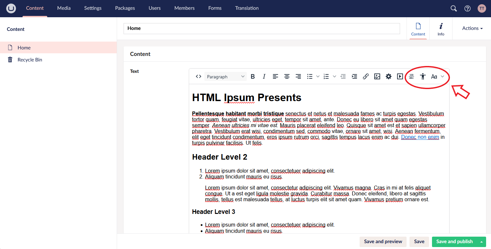

## TinyMCE for Umbraco CMS

This package brings the [TinyMCE](https://www.tiny.cloud/) Rich Text Editor (RTE) back to [Umbraco CMS](https://umbraco.com/), (version 16+).

### Installation

To [install from NuGet](https://www.nuget.org/packages/TinyMCE.Umbraco), you can run the following command from the `dotnet` CLI:

    dotnet add package TinyMCE.Umbraco

### Contributing

Contributions to this package are most welcome! Please read the [contributing guidelines](CONTRIBUTING.md).

### License

Copyright &copy; [ProWorks Corporation](https://proworks.com).

All source code is licensed under the [GNU General Public License Version 2](../LICENSE).

### Acknowledgments

Thanks to [TinyMCE](https://www.tiny.cloud/) and [Umbraco](https://umbraco.com/) for their support during the package development.
